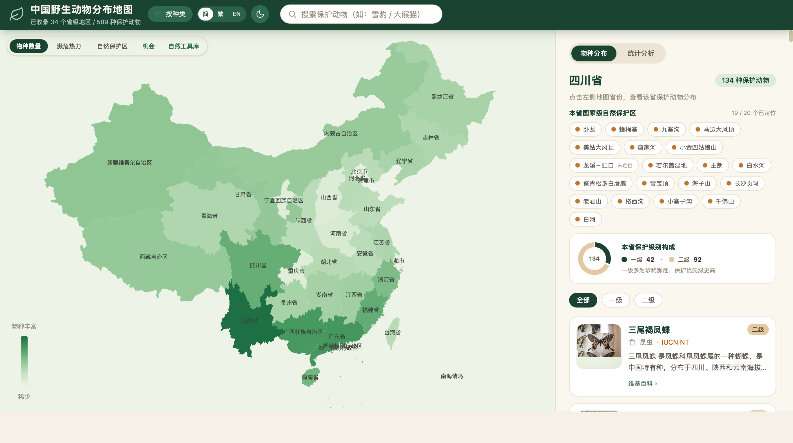
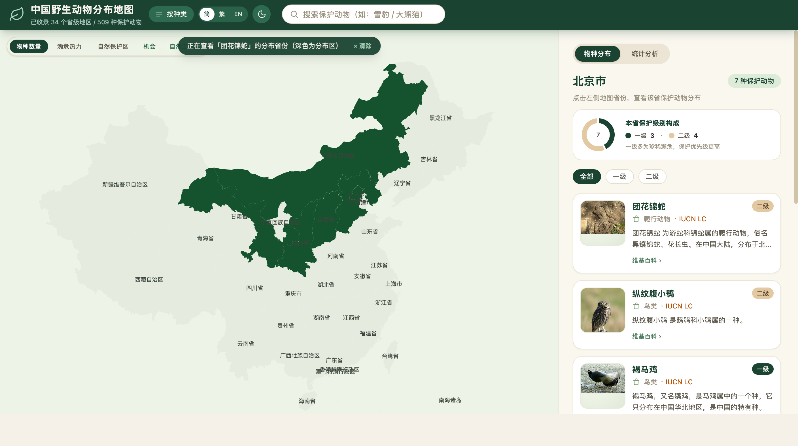
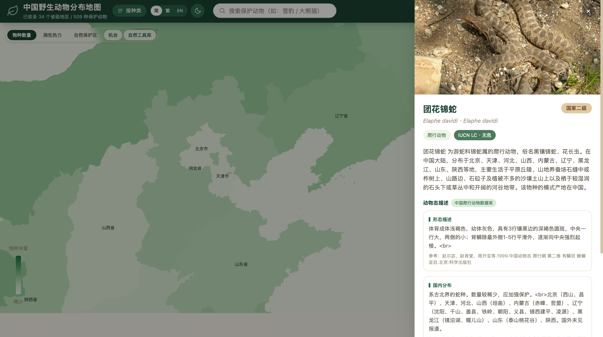
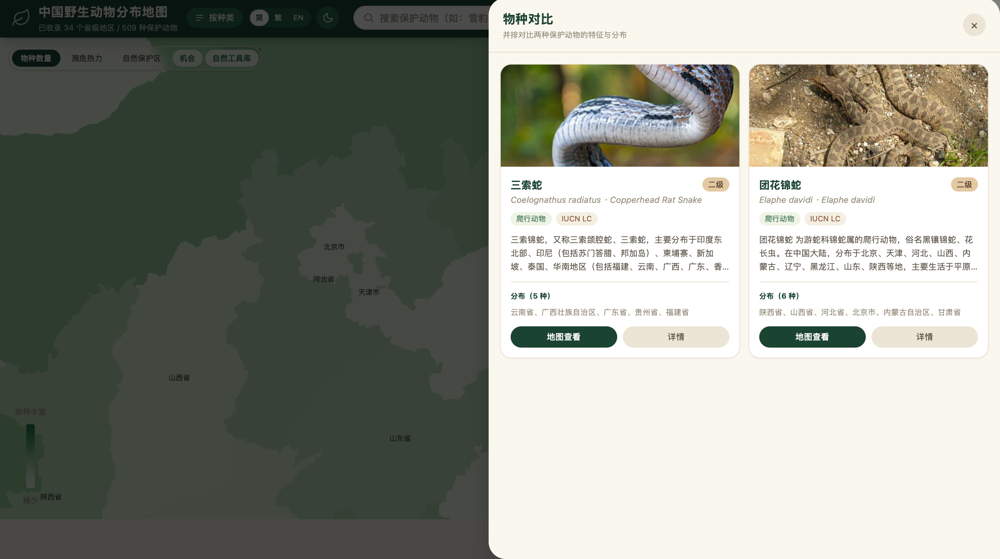
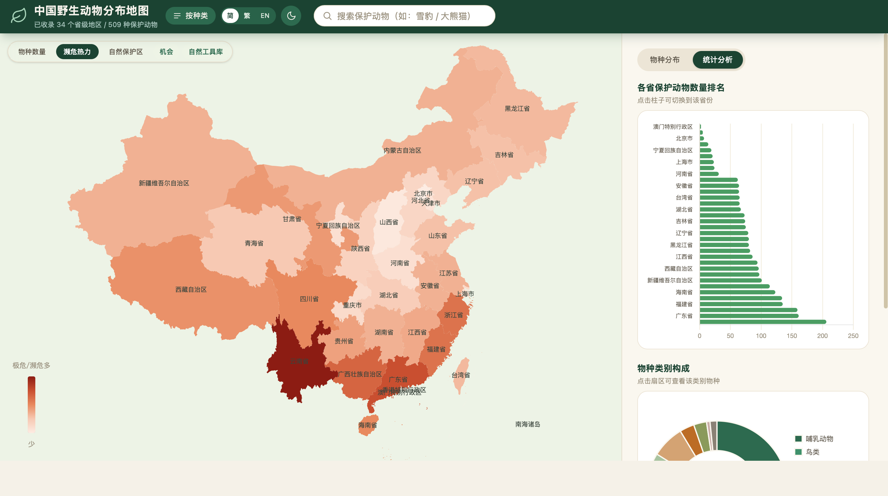
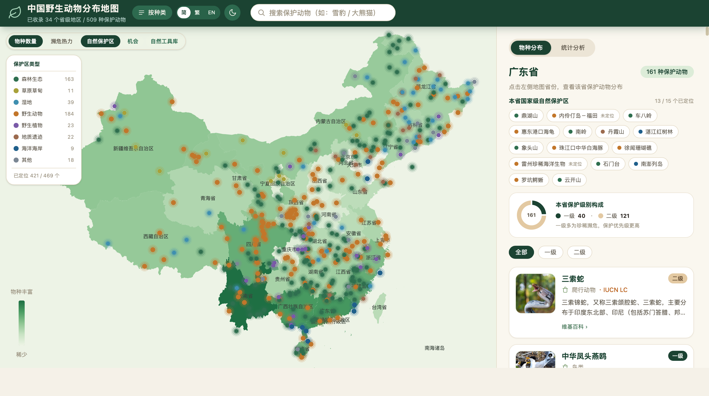
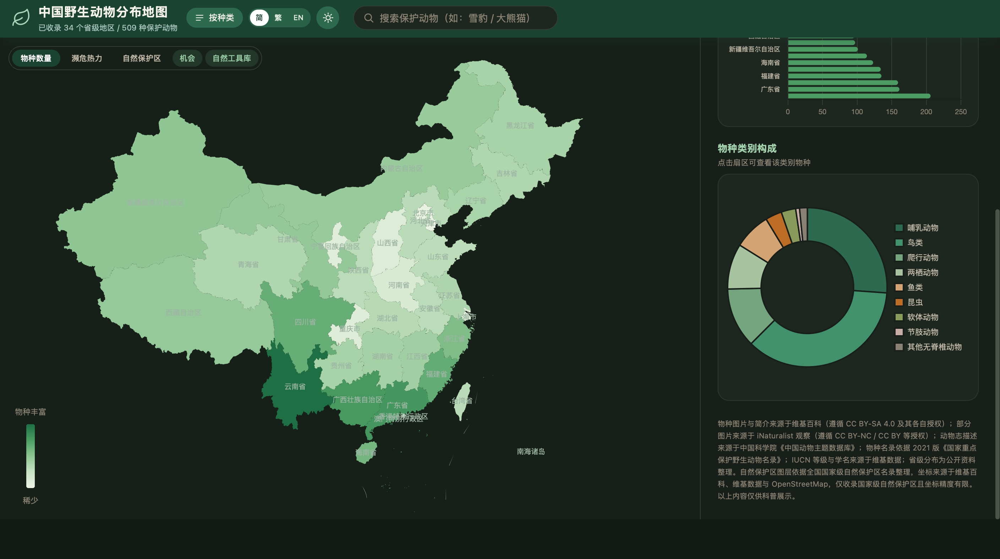
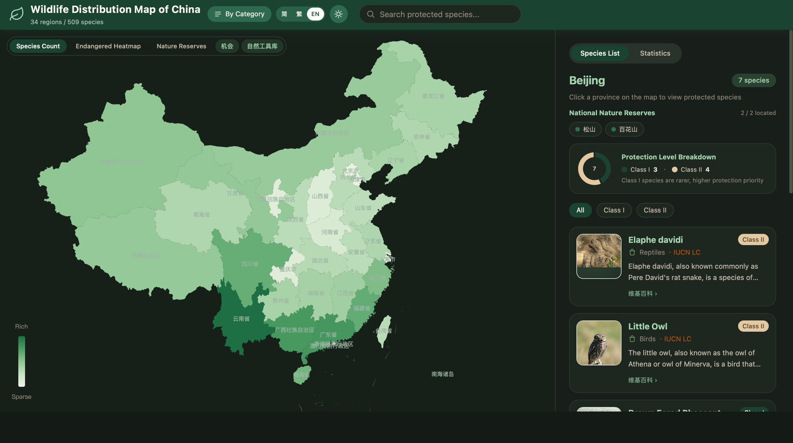
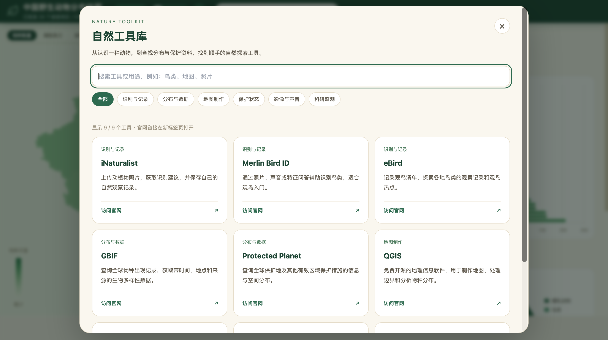
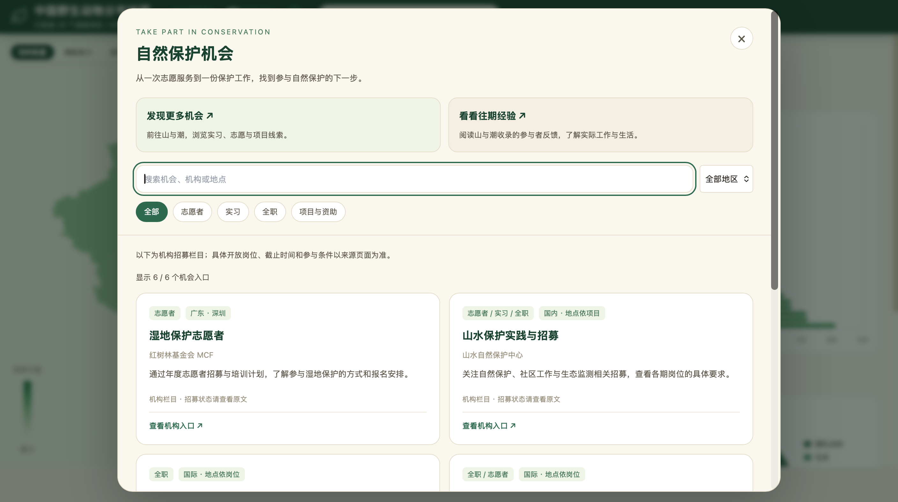

# 中国野生动物分布地图 · Wildlife Map of China

用一张交互地图，探索中国国家重点保护野生动物的省级分布。

Explore the provincial distribution of China's nationally protected wildlife through an interactive map.

[在线体验 / Live Demo](https://RavenWang1103.github.io/wildlife-map/) · [中文](#中文) · [English](#english)

## 中文

### 项目简介

中国野生动物分布地图是一个面向自然爱好者、学生和公众的科普可视化项目。通过地图、物种卡片和统计图表，了解不同省级地区收录的保护动物，探索物种分布、保护级别与自然保护区。

项目采用静态网页架构，无需数据库或后端服务，可在本地预览，也可部署到 GitHub Pages。

### 主要功能

- **省级分布地图**：点击省级地区查看已收录物种，按国家一级、二级保护级别筛选。
- **濒危物种热力**：展示数据中极危（CR）和濒危（EN）物种的省级数量分布。
- **物种搜索与详情**：支持中文名、英文名和学名搜索，查看图片、简介、保护级别及已有的 IUCN 状态等信息。
- **分布高亮与物种对比**：高亮单个物种的分布省份，并排比较两个物种。
- **自然保护区图层**：查看已收录的国家级自然保护区，按类型筛选，浏览省级名录及已有坐标信息。
- **统计分析**：查看各省已收录保护动物数量排名、物种类别和保护级别构成。
- **多语言与主题**：主要地图界面支持简体中文、繁体中文和英文切换，提供明暗主题及适配移动端的布局；部分附加内容仍为中文。
- **延伸资源**：提供自然观察工具及保护相关机构、志愿与职业机会入口。


#### 功能截图

**地图总览与省级分布**



**单个物种分布高亮**



**物种简介与详情**



**物种对比**



**濒危物种热力图**



**自然保护区图层**



**统计分析**



**夜间模式与英文界面**



**自然工具库**



**自然保护与实习机会**



### 本地运行

安装 Python 3 后，执行：

```bash
git clone https://github.com/RavenWang1103/wildlife-map.git
cd wildlife-map
python3 wildlife_map.py
```

默认访问地址为 `http://localhost:8080/`，启动时会自动打开浏览器。如果端口被占用，程序会尝试后续端口，以终端输出为准。

也可指定端口并关闭自动打开浏览器：

```bash
python3 wildlife_map.py --port 9000 --no-open
```

本地预览服务器仅使用 Python 标准库，无需安装额外 Python 依赖。图表库从 CDN 加载，部分图片来自外部网站，因此完整浏览需要网络连接。请通过本地 HTTP 服务访问页面。

### 技术与目录

- 前端：HTML、原生 JavaScript、Tailwind CSS
- 可视化：Apache ECharts、Chart.js
- 数据：本地 JSON 文件
- 数据整理与本地预览：Python

```text
wildlife-map/
├── index.html            # 页面及主要交互逻辑
├── css/                  # 样式源码与已生成的样式文件
├── data/                 # 物种、分布、地图边界及保护区数据
├── scripts/              # 数据采集、合并与信息补全脚本
├── wildlife_map.py       # 本地静态预览服务器
├── web.py                # 内嵌资源的版本存档与预览工具
├── tailwind.config.js    # Tailwind CSS 配置
└── deploy.sh             # 提交、推送及 GitHub Pages 部署校验脚本
```

### 数据说明

物种名录整理以 2021 年版《国家重点保护野生动物名录》为基础。仓库中的数据整理脚本涉及中国动物主题数据库、Wikipedia、Wikidata、iNaturalist 等来源；保护区坐标整理涉及 Wikipedia、Wikidata、OpenStreetMap 和高德地图等公开数据源。不同条目的信息完整度可能不同。

地图展示的是**项目已收录数据的省级分布概况**，不代表精确栖息地边界、实时监测结果或完整的物种调查。统计中的“数量”指已收录物种数，并非动物个体数量；未收录分布不表示该地没有该物种。国家保护级别与 IUCN 濒危等级是不同指标。

数据与保护区坐标仅供科普参考，可能存在缺漏或更新滞后。图片、文字及第三方数据的使用应遵循各自来源的许可和署名要求。

### 参与贡献

欢迎通过 [Issues](https://github.com/RavenWang1103/wildlife-map/issues) 或 Pull Request 提交分布纠错、信息补充、翻译与交互改进。涉及数据修改时，请附上可核查的来源、适用地区和资料日期。

---

## English

### About

Wildlife Map of China is an educational visualization project for nature enthusiasts, students, and the public. Interactive maps, species cards, and charts help users explore the recorded provincial distribution of nationally protected wildlife, protection classes, and nature reserves.

The project is a static website with no database or backend requirement. It can be previewed locally or hosted on GitHub Pages.

### Features

- **Provincial distribution map**: Select a province-level region to explore recorded species and filter by national Class I or Class II protection.
- **Threatened species heatmap**: Explore provincial counts of species recorded as Critically Endangered (CR) or Endangered (EN).
- **Species search and profiles**: Search by Chinese name, English name, or scientific name and view available photos, descriptions, protection classes, and IUCN status.
- **Distribution highlighting and comparison**: Highlight a species' recorded provinces and compare two species side by side.
- **Nature reserve layer**: Explore recorded national nature reserves, filter by type, and view provincial lists and available coordinates.
- **Statistics**: View provincial rankings by recorded species count, taxonomic composition, and protection-class breakdowns.
- **Languages and themes**: The main map interface supports Simplified Chinese, Traditional Chinese, and English, with light and dark themes and responsive layouts. Some supplementary content remains in Chinese.
- **Further resources**: Find nature observation tools and links to conservation organizations, volunteering, and career opportunities.


#### Screenshots

**Map overview and provincial distributions**


**Individual species distribution**


**Species profiles**


**Species comparison**


**Threatened species heatmap**


**Nature reserve layer**


**Statistics**


**Dark mode and English interface**


**Nature toolkit**


**Conservation and internship opportunities**


### Run locally

With Python 3 installed, run:

```bash
git clone https://github.com/RavenWang1103/wildlife-map.git
cd wildlife-map
python3 wildlife_map.py
```

The default address is `http://localhost:8080/`, and the browser opens automatically. If the port is occupied, the server tries subsequent ports; use the address printed in the terminal.

To choose a port and disable automatic browser opening:

```bash
python3 wildlife_map.py --port 9000 --no-open
```

The preview server uses only the Python standard library. No additional Python packages are required for previewing the site. An internet connection is needed for CDN-hosted chart libraries and externally hosted images. Access the page through the local HTTP server.

### Technology and structure

The frontend uses HTML, vanilla JavaScript, and Tailwind CSS, with Apache ECharts and Chart.js for visualization. Data is stored in local JSON files; Python scripts support data preparation and local preview.

| Path | Purpose |
| --- | --- |
| `index.html` | Main page and interaction logic |
| `css/` | Source and generated stylesheets |
| `data/` | Species, distributions, map boundaries, and reserves |
| `scripts/` | Data collection, merging, and enrichment |
| `wildlife_map.py` | Local static preview server |
| `web.py` | Embedded snapshot and preview utility |
| `tailwind.config.js` | Tailwind CSS configuration |
| `deploy.sh` | Commit, push, and GitHub Pages deployment verification |

### Data notes

The species list is based on the 2021 edition of China's List of National Key Protected Wild Animals. Repository scripts draw on sources including the China Animal Scientific Database, Wikipedia, Wikidata, and iNaturalist. Reserve coordinate sources include Wikipedia, Wikidata, OpenStreetMap, and Amap. Information coverage varies by record.

The map presents **provincial distribution summaries from the project's recorded data**. It does not represent precise habitat boundaries, live monitoring, or an exhaustive species survey. Counts refer to recorded species, not individual animals. Missing distribution records do not establish a species' absence. National protection classes and IUCN threat categories are separate measures.

Data and reserve coordinates are intended for educational reference and may be incomplete or outdated. Images, text, and third-party datasets remain subject to their respective licenses and attribution requirements.

### Contributing

Corrections, additional records, translations, and interface improvements are welcome through [Issues](https://github.com/RavenWang1103/wildlife-map/issues) or pull requests. For data changes, please include a verifiable source, the relevant region, and the source date.
